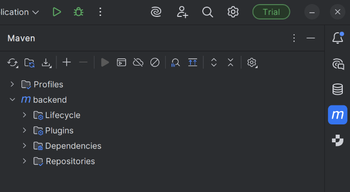
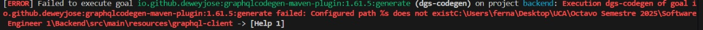

# Backend Unificado

Readme para el backend que todos van a usar en sus frontend

## Uso para usuarios de windows:

-Instalar Linux

## Uso para usuarios de Linux :

1-Tener instalado el Java 21.0.8

2-Tener instalado y corriendo el PostgreSQL con las tablas creadas con el .txt que mandó Hector en el grupo de Whatsapp
de SE

3-Meter crendeciales de la base de datos local en application.yaml (src/main/resources/application.yml)

4-Sincronizar el maven. Apretar el ciclo de flechas:

O correr el siguiente comando en la raíz del proyecto:

```bash
choco upgrade maven
```

5-Correr el programa en BackendApplication.Java

6- Si te sale el error:

Ir a src->main->resources y cambiar el nombre de la carpeta graphql por graphql-client

7-Ir a http://localhost:8080/graphiql?path=/graphql (capaz tarda un poquito al cargar)

# Guía (maso) para Alumnos :

Dentro del graphql, así se hacen las siguientes llamadas:
ara crear un Alumno:

```graphql
mutation {
  registrarAlumno(
    input: {
      usuario: {
        nombre: "Matías"
        apellido: "Rojas"
        email: "matias@uc.edu.py"
        telefono: "0999999999"
        ubicacion: "Asunción"
        password: "1234"
      }
      carrera: "Ingeniería Informática"
      semestre: 8
    }
  ) {
    idUsuario
    carrera
    semestre
    usuario {
      nombre
      apellido
      email
    }
  }
}
```

Para hacer login con un Alumno:

```graphql
mutation {
  login(input: {
    email: "matias@uc.edu.py",
    password: "1234"
  }) {
    idUsuario
    nombre
    apellido
    rolPrincipal
  }
}
```

Para que el Alumno cambie sus datos dentro de su perfil:

```graphql
mutation {
  actualizarAlumno(id: 2, input: {
    usuario: {
      nombre: "Rogesadfsadfr",
      apellido: "Gonzfffsdf",
      email: "matias@uc.es.py"
      ubicacion: "Asuncionsadfasdf"
      telefono: "09848599333sdfsd"
    },
    carrera: "Ingeniería Infasdfsdformática",
    semestre: 70

  }) {
    usuario { nombre apellido email }
    carrera
    semestre
  }
}
```

o para que consulte sus datos de perfil sin cambiarlos:

```graphql
query {
    consultarPerfil(idUsuario: 3) {
        nombre
        apellido
        email
        carrera
        semestre
    }
}
```

para crear una postulacion (dará error si un alumno ya se postuló a una oportunidad):

```graphql
mutation {
  crearPostulacion(idAlumno: 10, idOportunidad: 2) {
    idPostulacion
    estado
  }
}
```

para mostrar las oportunidades con filtro:

```graphql
query {
  bolsaTrabajo(filtro: {
    ubicacion: "Asunción"
    modalidad: "híbrido"
    empresa: "grupo4"
  }) {
    id
    titulo
    descripcion
    tipo
    ubicacion
    modalidad
    empresa
  }
}

```

# DOCENTES

## F0: Gestión de perfiles

### Registro al sistema: Docente

```graphql
mutation registrarProfesor{
  registrarProfesor(
    input: {
      usuario: {
        nombre: "Lucía"
        apellido: "González"
        email: "lucia@uca.edu.py"
        telefono: "0981999999"
        ubicacion: "Asunción"
        password: "1234"
      }
      departamento: "Informática"
      categoriaDocente: "Titular"
      areasDocentes: "SE1, Arquitectura"
    }
  ) {
    idUsuario
    departamento
    categoriaDocente
    usuario {
      nombre
      email
    }
  }
}
```

### Registro al sistema: Investigador

```graphql
mutation registrarInvestigador{
  registrarInvestigador(
    input: {
      usuario: {
        nombre: "Diego"
        apellido: "Medina"
        email: "diego@uca.edu.py"
        telefono: "0981222333"
        ubicacion: "Encarnación"
        password: "abcd"
      }
      areasInvestigacion: "Inteligencia Artificial, Deep Learning"
      afiliaciones: "UCA, Laboratorio de IA"
      hindex: 5
    }
  ) {
    idUsuario
    areasInvestigacion
    afiliaciones
    hindex
    usuario {
      nombre
      email
      rolPrincipal
    }
  }
}
```

### Inicio de sesión: Docente

```graphql
mutation loginDocente {
  loginDocenteInvestigador(input: {
    email: "lucia@uca.edu.py",
    password: "1234"
  }) {
    token
    usuario {
      idUsuario
      email
      rolPrincipal
    }
  }
}
```

### Inicio de sesión: Investigador

```graphql
mutation loginInvestigador {
  loginDocenteInvestigador(input: {
    email: "diego@uca.edu.py",
    password: "abcd"
  }) {
    token
    usuario {
      idUsuario
      email
      rolPrincipal
    }
  }
}
```

### Actualizar Perfil: Docente

```graphql
mutation actualizarProfesor{
  actualizarProfesor(id: 1020, input: {
    usuario: { nombre: "Luciana", apellido: "González" email: "luciana@uca.edu.py", password: "luci123" }
    departamento: "Software"
    categoriaDocente: "Actualizada"
  }) {
    usuario { nombre email }
    departamento
  }
}
```

### Actualizar Perfil: Investigador

```graphql
mutation actualizarInvestigador{
  actualizarInvestigador(
    id: 1021
    input: {
      usuario: {
        nombre: "Diego M."
        email: "diego@uca.edu.py"
        # opcional para cambiar clave (se hashea con bcrypt):
        #password: "nueva123"
        ubicacion: "Luque"
      }
      areasInvestigacion: "ChatGPT"
      afiliaciones: "Lab IA"
      hindex: 8
    }
  ) {
    idUsuario
    areasInvestigacion
    afiliaciones
    hindex
    usuario { nombre email }
  }
}

```

## F1: Manejo de postulantes + Ejemplos de uso en GraphQL

### Crear Postulación

```graphql
mutation crearPostulacion {
  crearPostulacion(idAlumno: 47, idOportunidad: 4) {
    idPostulacion
    estado
    alumno { usuario { nombre } }
    oportunidad { titulo }
    postulante { nombre } 
  }
}
```

### Listar Postulación

```graphql
query listarPostulacion {
  postulacionesPage(
    filtro: {
      idOportunidad: 4
      estados: [PENDIENTE, ACEPTADA]
      texto: "Roberto"
    }
    page: 0
    size: 10
  ) {
    total
    items {
      idPostulacion
      estado
      fechaPostulacion
      postulante { nombre }
      oportunidad { titulo }
    }
  }
}
```

### Actualizar Estado de Postulación

```graphql
mutation actualizarEstadoPostulacion {
  actualizarEstadoPostulacion(
    idPostulacion: 20,
    estado: ACEPTADA,
    motivo: "Cumple los requisitos del puesto"
  ) {
    idPostulacion
    estado
  }
}
```

**Transiciones válidas para update endpoints:**

- PENDIENTE → ACEPTADA  : Cuando el postulante es seleccionado.
- PENDIENTE → RECHAZADA : Cuando no cumple con los requisitos.
- PENDIENTE → CANCELADA : Cuando el postulante retira su solicitud o se cierra el proceso.
- ACEPTADA → CANCELADA : Si por alguna razón se revoca la aceptación.
- RECHAZADA → CANCELADA : Si el registro se anula o la postulación se borra administrativamente.
- CANCELADA - No puede cambiar más.

### Consultar Historial de Postulación

```graphql
query historialPostulacion {
  historialPostulacion(idPostulacion: 20) {
    fechaCambio
    estadoAnterior
    estadoNuevo
    motivo
  }
}
```

### Listar Oportunidades

```graphql
query listarOportunidades {
  oportunidades {
    idOportunidad
    titulo
    estado
    fechaPublicacion
  }
}
```

### Listar Oportunidades por Creador

```graphql
query oportunidadesPorCreador{
  oportunidadesPorCreador(creadorId: 1020) {
    idOportunidad
    titulo
    estado
    creador {
      idUsuario
      apellido
      rolPrincipal
    }
  }
}
```

### Crear Oportunidad

```graphql
mutation crearOportunidadDocente{
  crearOportunidadDocente(input: {
    idCreador: 51
    titulo: "Pasantía QA Backend"
    descripcion: "Testing de APIs GraphQL"
    requisitos: "Java, JUnit, Postman"
    ubicacion: "Asunción"
    modalidad: "híbrido"
    tipo: "pasantía"
    fechaCierre: "2025-12-31T23:59:00"
    estado: "activo"
  }) {
    idOportunidad
    titulo
    estado
    fechaPublicacion
    creador { idUsuario nombre email }
  }
}
```

## F2:Asociación de Evidencias al Portafolio

### Crear Postulacion con Evidencias

```graphql
mutation {
  crearPostulacion(
    idAlumno: 10
    idOportunidad: 4
  ) {
    idPostulacion
    estado
    fechaPostulacion
    evidencias {
      idEvidencia
      titulo
    }
  }
}
```

### Consultar evidencias por Alumno

```graphql
query {
  evidenciasPorAlumno(idAlumno: 13) {
    idEvidencia
    titulo
    descripcion
    tipo
  }
}
```

## F3: Endorsements

### Crear Endorsement

```graphql
mutation createEndorsement{
  createEndorsement(
    input: { toUserId: 13, skill: "GraphQL", message: "Excelente trabajo en F1" }
  ) {
    idEndorsement
    status
    fromUserId
    toUserId
    skill
    message
    createdAt
  }
}
```

### Consultar Endorsement

```graphql
query endorsements {
  endorsementsReceived(status: PENDING) {
    idEndorsement
    fromUserId
    toUserId
    skill
    message
    status
    createdAt
  }
}
```

### Consultar Endorsement Dados

```graphql
query endorsementsGiven{
  endorsementsGiven {
    idEndorsement
    toUserId
    skill
    message
    status
  }
}
```

### Aceptar/Rechazar Endorsement

```graphql
mutation endorsementDecision {
  decideEndorsement(id: 6, accept: false) {
    idEndorsement
    status
    decidedAt
  }
}
```

## Portafolio

```graphql
mutation crearPortafolio {
  crearPortafolio(input: {
    idUsuario: 2
    descripcion: "Hola soy Juanchi Kun"
    skills: "Java, Spring"
    visibilidad: true
  }) {
    idPortafolio
    descripcion
    idAuditoria
  }
}

mutation actualizarPortafolio {
  actualizarPortafolio(input: {
    idUsuario: 2
    descripcion: "Perfil actualizado de Juanchi Kun"
    skills: "Java, Spring, React"
    visibilidad: false
  }) {
    idPortafolio
    descripcion
    skills
    visibilidad
    ultimaActualizacion
    idAuditoria
  }
}


query consultarPortafolio {
  portafolioPorUsuario(idUsuario: 2) {
    idPortafolio
    descripcion
    skills
    visibilidad
    ultimaActualizacion
    idAuditoria
    evidencias {
      idEvidencia
      titulo
      tipo
    }
  }
}

```

## Evidencia

```graphql
mutation agregarEvidencia {
  agregarEvidencia(input: {
    idPortafolio: 1
    idUsuario: 2
    titulo: "Certificado Java SE 11"
    descripcion: "Certificado emitido por Oracle"
    tipo: "CERTIFICADO"
    recurso: "https://mis-evidencias.com/java11.pdf"
  }) {
    idEvidencia
    titulo
    tipo
    idPortafolio
    idAuditoria
  }
}


mutation editarEvidencia {
  editarEvidencia(input: {
    idEvidencia: 2
    idUsuario: 2
    titulo: "Certificado Java SE 11 (Actualizado)"
    descripcion: "Actualización de datos"
    tipo: "LOGRO"
    recurso: "https://mis-evidencias.com/java11-new.pdf"
  }) {
    idEvidencia
    titulo
    tipo
    descripcion
    idAuditoria
  }
}


mutation eliminarEvidencia {
  eliminarEvidencia(
    idEvidencia: 1
    idUsuario: 2
  )
}


query evidenciasUsuario {
  evidenciasPorUsuario(idUsuario: 2) {
    idEvidencia
    titulo
    tipo
    idPortafolio
  }
}


query evidenciasPorPortafolio {
  evidenciasPorPortafolio(idPortafolio: 1) {
    idEvidencia
    titulo
    tipo
  }
}


query evidenciasPorAlumno {
  evidenciasPorAlumno(idAlumno: 2) {
    idEvidencia
    titulo
    tipo
    idPortafolio
  }
}

```